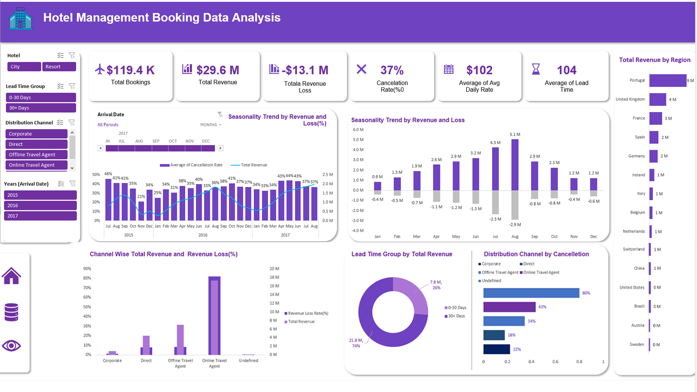

# Hotel Management Booking Data Analysis Dashboard

## Overview
This project provides a comprehensive analysis of hotel booking data, focusing on revenue, cancellations, lead times, and distribution channels. The dashboard is designed to help hotel management teams make data-driven decisions to optimise performance and reduce revenue loss.

---

## Key Features
- **Total Bookings & Revenue**: Track overall booking volume and revenue generation.
- **Revenue Loss & Cancellation Rate**: Identify cancellation trends and quantify financial impact.
- **Average Daily Rate (ADR)**: Monitor pricing effectiveness.
- **Lead Time Analysis**: Compare short-term vs. long-term booking behaviors.
- **Seasonality Trends**: Visualize monthly revenue and cancellation fluctuations.
- **Channel Performance**: Evaluate revenue and cancellation rates across distribution channels.
- **Regional Insights**: Assess revenue contributions by country/region.

---

## Dashboard Components
1. **Seasonality Trend by Revenue & Loss (%)**
   - Monthly cancellation rates and revenue patterns.
2. **Seasonality Trend by Revenue & Loss**
   - Revenue vs. loss comparison across months.
3. **Channel-wise Revenue & Loss (%)**
   - Distribution channel performance breakdown.
4. **Lead Time Group Analysis**
   - Revenue split between 0–30 days vs. 30+ days.
5. **Distribution Channel by Cancellation**
   - Cancellation rates segmented by booking channel.
6. **Revenue by Region**
   - Country-level revenue contributions (e.g., Portugal leading at $9M).

---

## 🛠️ Tech Stack
- **Data Source**: Hotel booking dataset (2015–2017)
- **Tools Used**:Excel
- **Visualisation**: Interactive charts (bar, donut, line graphs)

---

## 🎯 Business Insights
- High cancellation rate (37%) significantly impacts revenue.
- Majority of revenue (74%) comes from long lead-time bookings.
- Online Travel Agents contribute heavily to both revenue and cancellations.
- Portugal is the top revenue-generating region.
- Seasonality plays a major role, with peaks and dips across months.

---

## 📌 Usage
1. Filter by:
   - Hotel Type (City, Resort)
   - Lead Time Group (0–30 Days, 30+ Days)
   - Distribution Channel (Corporate, Direct, Offline Agent, Online Agent)
   - Arrival Year (2015–2017)
2. Explore interactive charts to identify trends and insights.
3. Use findings to:
   - Adjust pricing strategies
   - Improve cancellation policies
   - Optimize distribution channel mix

---

## 📂 Project Goals
- Provide actionable insights for hotel management.
- Reduce revenue loss by identifying cancellation drivers.
- Enhance strategic decision-making with data visualization.

- Integrate real-time booking data.
- Expand regional analysis for global hotel chains.
